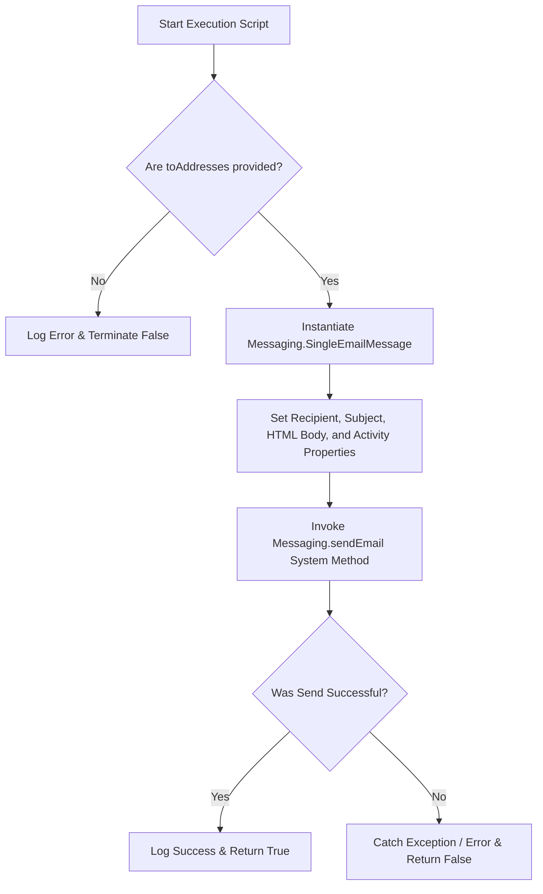

# 📨 Cloud Computing Lab — Experiment 2
> **Implementation of a Reusable Mailing Service using Salesforce Apex**

[](https://salesforce.com)
[](https://salesforce.comdocs/atlas.en-us.apexcode.meta/apexcode/apex_intro.htm)
[](#)

---

## 🎯 Aim
To design and implement a robust, production-ready asynchronous **Mailing Service** utility class utilizing the **Salesforce Apex Programming Language** (`Messaging.SingleEmailMessage`), allowing users to programmatically dispatch HTML-formatted transactional emails to multiple external recipients.

---

## ⚙️ Architecture & Design Considerations
* **Data Encapsulation:** Implemented with `with sharing` keywords to respect Salesforce standard record visibility settings.
* **Bulkification Safe:** Operates using native Apex Collection lists (`List<String>`) to handle multi-recipient transaction scaling seamlessly.
* **Robust Error Handling:** Embedded inside `try-catch` structures with comprehensive logging (`System.debug`) to catch transactional runtime exceptions.
* **Governor Limit Awareness:** Built-in proactive validation checks for null or empty string vectors to intercept and eliminate wasteful standard transaction execution.

---

## 🧭 System Algorithm



---

## 📁 Repository Structure
```text
cc lab/
└── cc2/
    ├── EmailService.cls            # Core Apex backend logic
    ├── TestMailingScript.apex     # Anonymous execution script 
    └── README.md                   # Lab documentation (This file)
```

---

## 🖥️ Execution Instructions

### 1. Execute via Anonymous Window
Open your **Salesforce Developer Console**, open the **Execute Anonymous Window** (`Ctrl + E`), and run the contents of `TestMailingScript.apex`:

```apex
List<String> recipients = new List<String>{'student@example.com'}; 
String subject = 'Cloud Computing Lab - Exp 2';
String body = '<h1>Experiment Successful!</h1><p>Sent via Apex Mail Engine Engine.</p>';

Boolean isSuccess = EmailService.sendHtmlEmail(recipients, subject, body);
System.debug('Mail Server Status: ' + isSuccess);
```

### 2. Verify Output Logs
Open the generation log console and check the runtime transaction execution statements:
* Look for: `USER_DEBUG|[31]|DEBUG|Email sent successfully.`
* Look for: `USER_DEBUG|[34]|DEBUG|Mail Server Status: true`

---

## 📊 Expected Output Screenshot

| Step | Action | Log Statement / Result |
| :--- | :--- | :--- |
| **01** | Apex Class Compiled | `Compilation Successful (No errors)` |
| **02** | Script Executed | `Execution Status: Success` |
| **03** | System Log Verified | `DEBUG \| Email sent successfully.` |
| **04** | Inbox Received | *HTML Email delivers straight to inbox* 📬 |

---
🔬 *Submitted as part of the Cloud Computing Lab Portfolio.*
